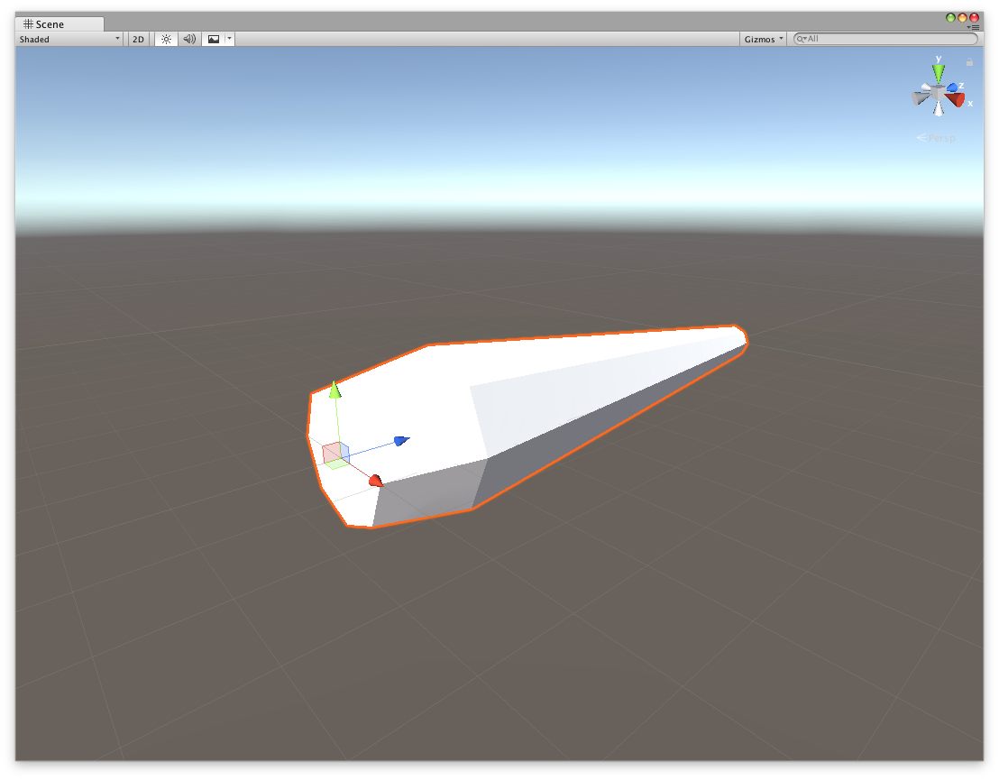
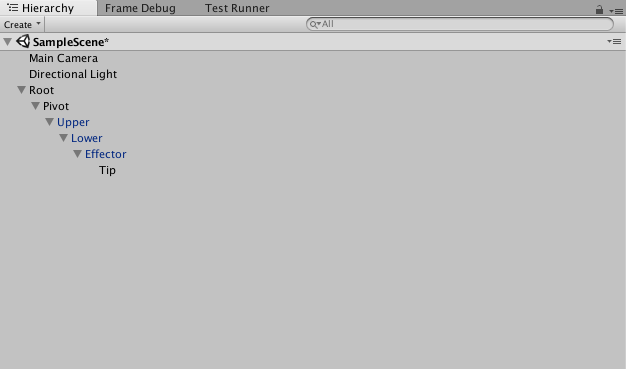
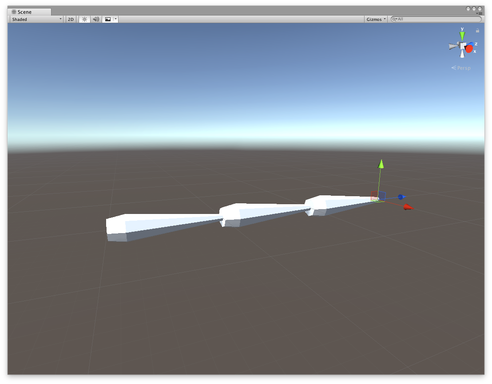
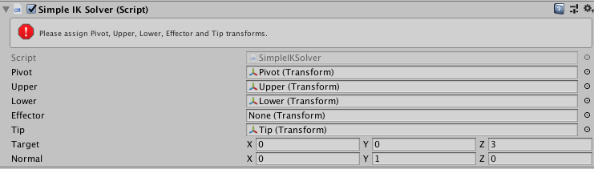
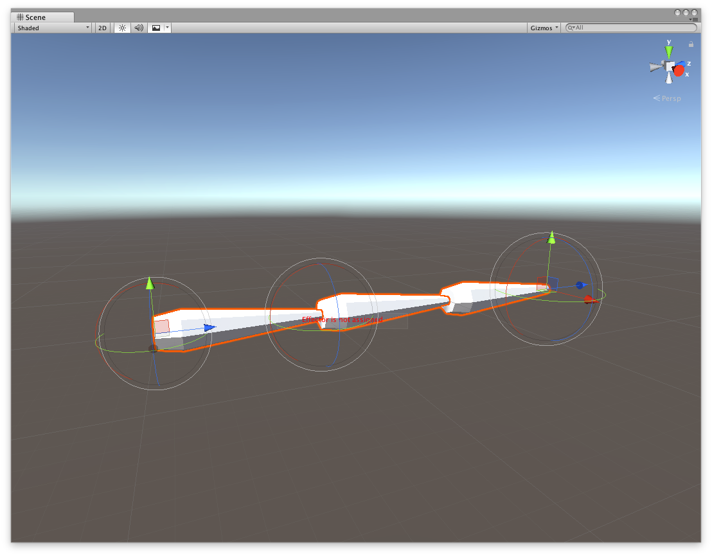
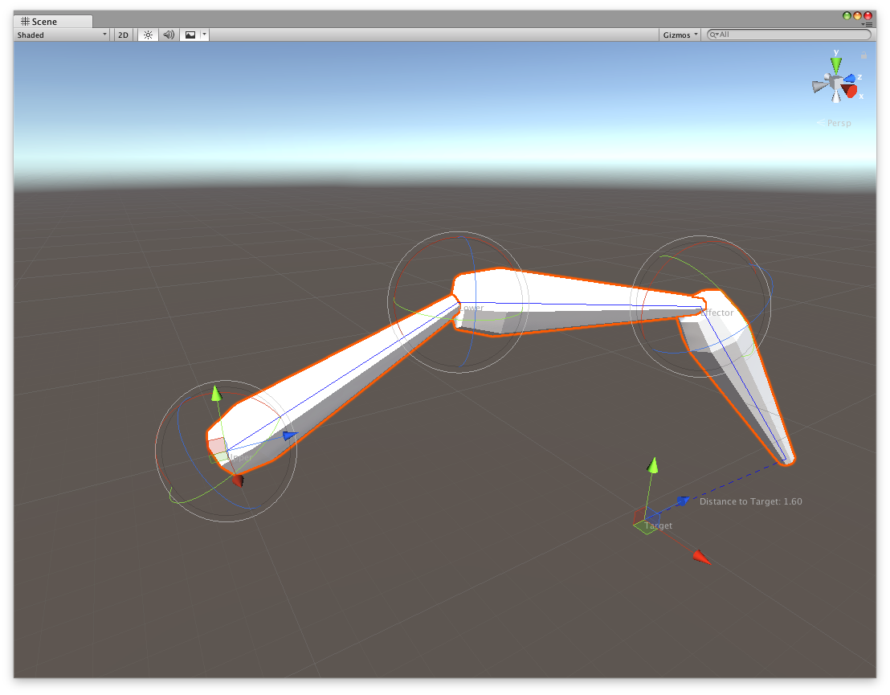

Getting Started with IK
-----------------------

Author: Simon Wittber <simonwittber@unity3d.com>

Inverse Kinematics (IK) is the process of calculating rotations for a set of 
joints in order to make the final joint reach some position. For example, IK can
be used to calculate the rotations for shoulders, elbows and wrist which are
required for the fingers to reach a point in space.

There are a number of approaches to creating IK solutions in Unity, which can be
complex and difficult to understand. However, sometimes a simple solution is all
that is required to achieve a reasonable end result. This tutorial covers a
simple solution for 3 or 4 jointed limbs, and shows how to support developers
using the solution using some custom Unity Editor scripting.

# Setting up a test scene for development.

You will need a model of an arm segment which is setup with the forward axis
matching the unity forward axis (x:0,y:0,z:1) with the pivot point set to the 
same position the joint should rotate around. Segment.fbx is provided in the
sample project which fills these requirements.

Create an empty gameobject which will be the root of your arm. Create a 
second, empty child gameobject which operates as the main pivot. Then, attach
three segments to create an arm. Finally, create an empty gameobjcet at the end
of the hierarchy and name it 'Tip'. This position is the point where you want to
match your target position.

Using the position handles in the scene view, layout your gameobjects so they
resemble a mechanical arm, similar to the screenshot below. Notice the tip 
gameobject is position at the very end of the last segment.

Now is a good time to save your scene.

# Writing Some Code!

## The actual IK solver

Our IK algorithm is going to use the [law of cosines](https://en.wikipedia.org/wiki/Law_of_cosines)
and a little bit of cheating to work out the final effector angle. The effector
is the transform one up from the hierarchy from the tip. The pivot is the first
transform after the root. That leaves two transforms in the middle of our chain.
If we manually position the pivot and the effector, we can use the law of 
cosines to work out the correct rotations for the two middle transforms.

### The Monobehaviour class

Create a new script called SimpleIKSolver.cs. We need to add the fields required
to hold our chain of transforms, and the data we need to perform the 
calculations.

    public class SimpleIKSolver : MonoBehaviour
    {
    
        public Transform pivot, upper, lower, effector, tip;
        public Vector3 target = Vector3.forward;
        public Vector3 normal = Vector3.up;
    
    
        float upperLength, lowerLength, effectorLength, pivotLength;
        Vector3 effectorTarget, tipTarget;
    }

This behaviour class should be assigned to the pivot gameobject. But before you
do this, we will create a method to make the component inspector setup less
painful! Add the below method to your class, then add it as a component to the
pivot gameobject.

    void Reset()
    {
        pivot = transform;
        try
        {
            upper = pivot.GetChild(0);
            lower = upper.GetChild(0);
            effector = lower.GetChild(0);
            tip = effector.GetChild(0);
        }
        catch (UnityException)
        {
            Debug.Log("Could not find required transforms, please assign manually.");
        }
    }

This method automatically runs when the component is first attached to a 
gameobject. It tries to find the required gameobjects and assign them to the
correct slots in the inspector. However, if it can't find the gameobjects, it
will print out a helpful message. 

We now need to collect some data for use in our trignometry calculations. The
data we need is the length of each segment. We should do this at runtime in the
Awake method, so that we know it is always correct for the current setup of the
hierarchy.
    
    void Awake()
    {
        upperLength = (lower.position - upper.position).magnitude;
        lowerLength = (effector.position - lower.position).magnitude;
        effectorLength = (tip.position - effector.position).magnitude;
        pivotLength = (upper.position - pivot.position).magnitude;
    }

Next, the Update function is going to calculate the target positions and call
the yet-to-be-written Solve method.

    void Update()
    {
        tipTarget = target;
        effectorTarget = target + normal * effectorLength;
        Solve();
    }

This is where we start to cheat a little. We directly set the orientation of the
final segment using the normal field. This field could be set to a constant 
value, or dynamically changed based on collision normal or some other mechanism.
As we know the orientation of the final segment, we can calculate the target
position of the effector transform, using our known orientation and the length
of effector.

### The IK Algorithm

The complete IK algorithm is listed below for your copy/paste convenience.

We know the last joint orientation, which leaves three more joints to solve. 
Let's cheat some more, and rotate the pivot transform so it is looking directly
at the tipTarget.

    var pivotDir = effectorTarget - pivot.position;
    pivot.rotation = Quaternion.LookRotation(pivotDir);
    
That leaves two rotations we need to calculate, fortunately this is a well known
problem which we can solve using trigonometry (law of cosines). The variables
'a', 'b' and 'c' are the lengths of the triangle formed by the transform chain.

        var upperToTarget = (effectorTarget - upper.position);
        var a = upperLength;
        var b = lowerLength;
        var c = upperToTarget.magnitude;
        
We can then apply the law of cosines to calculate the internal angles of the abc
triangle.

    var B = Mathf.Acos((c * c + a * a - b * b) / (2 * c * a)) * Mathf.Rad2Deg;
    var C = Mathf.Acos((a * a + b * b - c * c) / (2 * a * b)) * Mathf.Rad2Deg;
    
Note, we need to check that C is a valid number, as sometime we can form an 
impossible to solve triangle with our joint orientations. if the C variable is
ok, the next step is to convert the angles into rotations which we can apply to
our segments.

    if (!float.IsNaN(C))
    {
        var upperRotation = Quaternion.AngleAxis((-B), Vector3.right);
        upper.localRotation = upperRotation;
        var lowerRotation = Quaternion.AngleAxis(180 - C, Vector3.right);
        lower.localRotation = lowerRotation;
    }

Finally, we orient the last segment (effector) to point at the tipTarget.

    var effectorRotation = Quaternion.LookRotation(tipTarget - effector.position);
    effector.rotation = effectorRotation;
    
The Complete Method:

    void Solve()
    {
        var pivotDir = effectorTarget - pivot.position;
        pivot.rotation = Quaternion.LookRotation(pivotDir);

        var upperToTarget = (effectorTarget - upper.position);
        var a = upperLength;
        var b = lowerLength;
        var c = upperToTarget.magnitude;

        var B = Mathf.Acos((c * c + a * a - b * b) / (2 * c * a)) * Mathf.Rad2Deg;
        var C = Mathf.Acos((a * a + b * b - c * c) / (2 * a * b)) * Mathf.Rad2Deg;

        if (!float.IsNaN(C))
        {
            var upperRotation = Quaternion.AngleAxis((-B), Vector3.right);
            upper.localRotation = upperRotation;
            var lowerRotation = Quaternion.AngleAxis(180 - C, Vector3.right);
            lower.localRotation = lowerRotation;
        }
        var effectorRotation = Quaternion.LookRotation(tipTarget - effector.position);
        effector.rotation = effectorRotation;
    }

At this point, the IK solve is complete and should work in your editor. But it
is not very easy to debug or use at the moment, so we need to add some editor
controls which let us test the system is working as expected.

## Scripting the Editor

Create a new script in an Editor folder, call it SimpleIKSolverEditor.cs. 
Edit the script and paste in this code:

    [CustomEditor(typeof(SimpleIKSolver))]
    public class SimpleIKSolverEditor : Editor
    {
    }
    
We are now ready to start customising the editor!

### Customising the Inspector

First, we will modify the inspector to warn us when any of the transforms 
required for our solver are missing. If any of the transforms are null, we will
display an error message directly in the inspector. Then, we draw the default
inspector as the default functionality is good enough for this component.

    public override void OnInspectorGUI()
    {
        var s = target as SimpleIKSolver;
        if (s.pivot == null || s.upper == null || s.lower == null | s.effector == null || s.tip == null)
            EditorGUILayout.HelpBox("Please assign Pivot, Upper, Lower, Effector and Tip transforms.", MessageType.Error);
        base.OnInspectorGUI();
    }
    
    
    
### Customising the Gizmo

Second, we are going to write a gizmo function for showing the same error 
information from the inspector, in the sceneview. We can also draw some helpful
information, showing the distance from our target position to the tip position.
The default labels in the sceneview are a bit difficult to see, so create an 
guistyle which we can use to make them more visible.

    static GUIStyle errorBox;

    void OnEnable()
    {
        errorBox = new GUIStyle(EditorGUIUtility.GetBuiltinSkin(EditorSkin.Scene).box);
        errorBox.normal.textColor = Color.red;
    }

This is the function that will draw the gizmo in the scene view. We pass in the
guistyle we just created to the Handles.Label method. If any of the transforms
are missing, we immediately exit the method, as none of the further drawing
operations would work.

Finally, we draw a blue line showing the segments in our chain, and a dotted
line showing the delta between the tip position and target position.

    [DrawGizmo(GizmoType.Selected)]
    static void OnDrawGizmosSelected(SimpleIKSolver siks, GizmoType gizmoType)
    {
        Handles.color = Color.blue;
        if (siks.pivot == null)
        {
            Handles.Label(siks.transform.position, "Pivot is not assigned", errorBox);
            return;
        }
        if (siks.upper == null)
        {
            Handles.Label(siks.pivot.position, "Upper is not assigned", errorBox);
            return;
        }
        if (siks.lower == null)
        {
            Handles.Label(siks.upper.position, "Lower is not assigned", errorBox);
            return;
        }
        if (siks.effector == null)
        {
            Handles.Label(siks.lower.position, "Effector is not assigned", errorBox);
            return;
        }
        if (siks.tip == null)
        {
            Handles.Label(siks.effector.position, "Tip is not assigned", errorBox);
            return;
        }
        Handles.DrawPolyLine(siks.pivot.position, siks.upper.position, siks.lower.position, siks.effector.position, siks.tip.position);
        Handles.DrawDottedLine(siks.tip.position, siks.target, 3);
        Handles.Label(siks.upper.position, "Upper");
        Handles.Label(siks.effector.position, "Effector");
        Handles.Label(siks.lower.position, "Lower");
        Handles.Label(siks.target, "Target");
        var distanceToTarget = Vector3.Distance(siks.target, siks.tip.position);
        var midPoint = Vector3.Lerp(siks.target, siks.tip.position, 0.5f);
        Handles.Label(midPoint, string.Format("Distance to Target: {0:0.00}", distanceToTarget));
    }
    

### Customising the Scene View

The final two functions draw a Rotation handle at each pivot point, allowing
you to rotate each joint in the chain without having to deselect the main pivot
transform. We also use a position handle for the target position, and a rotation
handle to modify the normal field.

    public void OnSceneGUI()
    {
        var siks = target as SimpleIKSolver;
        RotationHandle(siks.effector);
        RotationHandle(siks.lower);
        RotationHandle(siks.upper);
        siks.target = Handles.PositionHandle(siks.target, Quaternion.identity);
        var normalRotation = Quaternion.LookRotation(Vector3.forward, siks.normal);
        normalRotation = Handles.RotationHandle(normalRotation, siks.tip.position);
        siks.normal = normalRotation * Vector3.up;
    }

This method will draw a rotation handle for any transform. We use it above on 
the upper, lower and effector transforms. It will only change the rotation value
if it has been changed, this is detected by using the BeginChangeCheck and 
EndChangeCheck methods. If it was changed, we record the state of the transform
so that the Undo/Redo system will work correctly, then assign the new rotation
value to the transform.rotation property.

    void RotationHandle(Transform transform)
    {
        if (transform != null)
        {
            EditorGUI.BeginChangeCheck();
            var rotation = Handles.RotationHandle(transform.rotation, transform.position);
            if (EditorGUI.EndChangeCheck())
            {
                Undo.RecordObject(transform, "Rotate");
                transform.rotation = rotation;
            }
        }
    }

We now have a simple IK system with a nice editor interface, ready to extend and
use with any chain of transforms.

